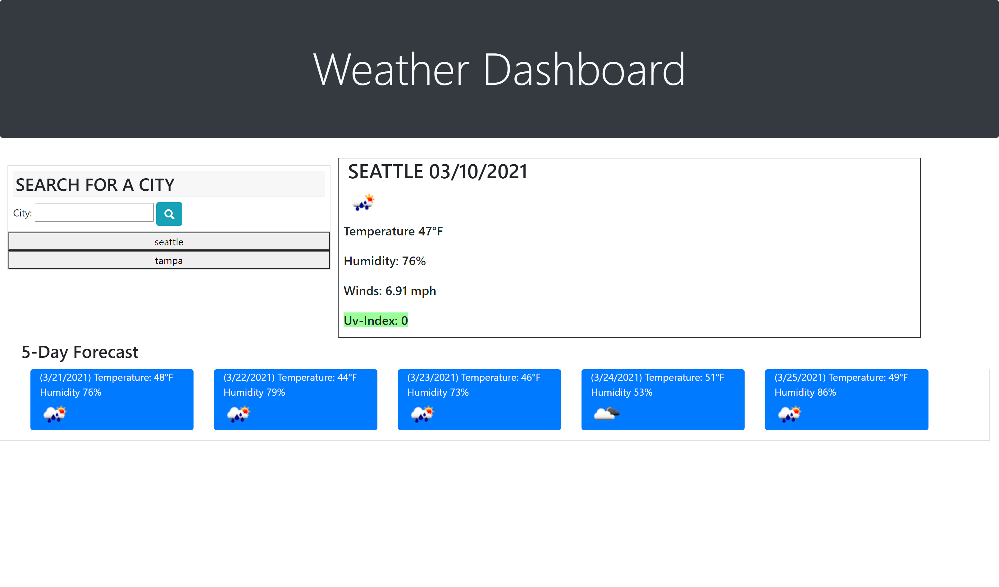
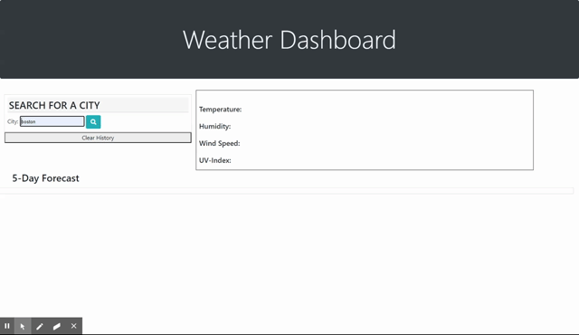

# Weather-Forecast

Weather Forecast Dashboard

1. [Description](#desc)
2. [Navigation](#nav)
3. [Contributions](#contrib)
​
​
### Weather Dashboard-Find Current Weather and 5 Day Forecast Data!

## 1. Description
​
The acceptance criteria was to create a weather dashboard application that displayed the current weather of a city that a user searches for. My weather dashboard displays the city name, the current date of search, temperature, humidity, wind speed and the uv-index. Below you will find the five day forecast so you can address appropriately.
​

## 2. Navigation
​
[Github Pages Live Site] https://bdurham227.github.io/Weather-Forecast/

[Github Repo Site] https://github.com/bdurham227/Weather-Forecast

Live page view: 

​
​

Gif demonstrating the applications functionality:

​

## 3. Contributions
​
This project was created by myself, with suggestions and perspectives from the following people:

Patrick Walker
​
Jason Barbanel
​
Takuya Matsumoto
​
Gabe Thomas